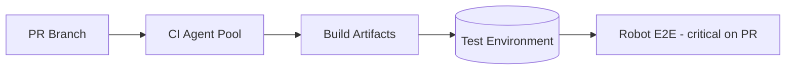
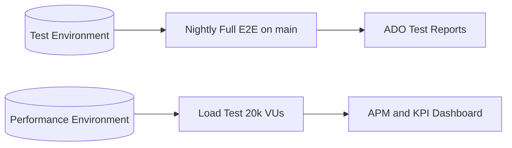
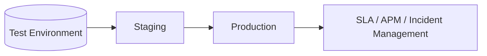

# Deployment Topology

Environment layout and promotion paths for Development & Test workloads.

## Per-PR flow

## Scheduled and release flows

## Future: Launch and Monitor (low maturity on baseline slide)

## Environment characteristics

| Environment | Purpose | Deploy trigger | Notes |
|-------------|---------|----------------|-------|
| **Dev** | Local and early integration | Developer machine | SonarLint only; optional local unit tests |
| **Test / QA** | PR validation, Robot E2E | Every PR (after QG) + on merge | Stable test data; seeded identities |
| **Performance** | Steel Thread load tests | Scheduled / pre-release | Isolated; no shared resources with Test |
| **Staging** | Pre-prod validation | Release branch | Phase 3+ |
| **Production** | Live workloads | Approved release | Phase 3+; ties to Launch & Monitor |

## Pipeline stage mapping (ADO)

| Stage | Runs on | Blocks merge |
|-------|---------|--------------|
| Build + unit | PR, main | Yes |
| SonarQube scan + QG | PR, main | Yes |
| Deploy to test | PR (if critical paths), main | PR: optional policy |
| Robot `@critical` | PR | Yes (if policy enabled) |
| Robot full suite | Nightly on main | No (alerting) |
| Load test | Weekly / release | No (release gate optional) |

## Related documents

- [logical-architecture.md](logical-architecture.md)
- [../workflow/macro-workflow.md](../workflow/macro-workflow.md)
- [../sequences/robot-e2e.md](../sequences/robot-e2e.md)
