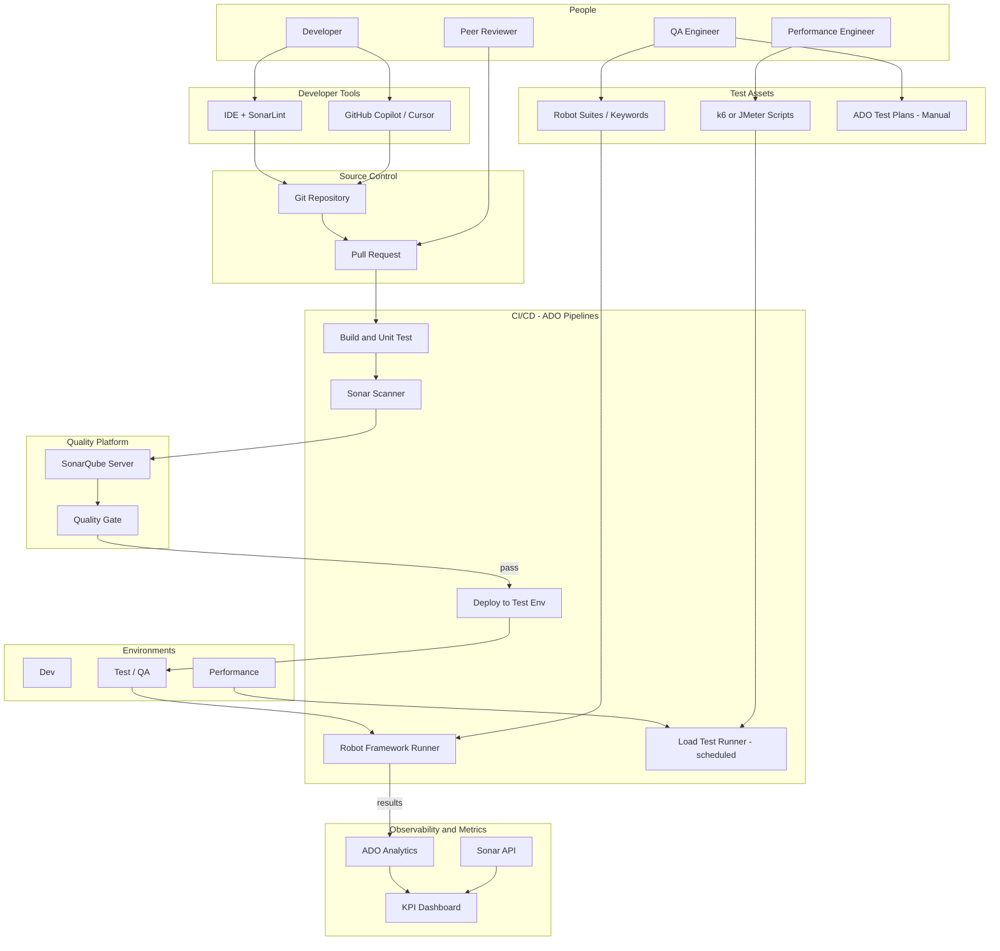

# Logical Architecture

Container-level view of the GenAI-integrated **Development & Test** platform.

## Container diagram

## Component responsibilities

| Component | Responsibility |
|-----------|----------------|
| **IDE + SonarLint** | Shift-left: bugs, code smells, security issues before commit |
| **GenAI (Copilot / Cursor)** | Generate code and tests per standards; does not replace gates |
| **Git + PR** | Single path to integration; audit trail |
| **SonarQube + Quality Gate** | Coverage, duplications, vulnerabilities on PR |
| **CI build + unit tests** | Fast feedback (target <10 minutes) |
| **Robot + test environment** | E2E critical journeys; JUnit/XML to ADO |
| **Load runner + perf environment** | Steel Thread scenarios; scale to 20k+ VUs |
| **ADO test plans** | Manual test traceability and automation backlog |
| **KPI dashboard** | Merge time, coverage, automation %, load coverage |

## Data and integration flows

| Flow | From → To | Purpose |
|------|-----------|---------|
| Code diff | Git → SonarQube | Analyze new/changed code |
| Coverage | Test runner → SonarQube | Quality gate enforcement |
| E2E results | Robot → ADO Tests | Pass/fail trends |
| Work items | ADO → PR description | Requirement traceability |
| Program metrics | Git / ADO / Sonar APIs → Dashboard | KPI reporting |

## Security and compliance constraints

- Secrets only in ADO variable groups or Azure Key Vault
- GenAI: no PII or secrets in prompts; policy approved by Legal/Security
- SonarQube: block critical/high vulnerabilities on PR merge
- Performance environment: anonymized data; isolated network; no production credentials

## Related documents

- [deployment-topology.md](deployment-topology.md)
- [adr.md](adr.md)
- [../sequences/pr-merge-happy-path.md](../sequences/pr-merge-happy-path.md)
