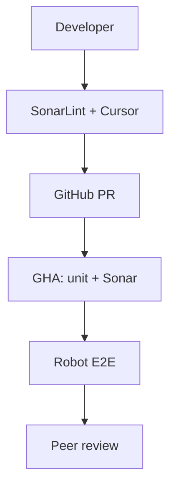

# As-Is (POC) vs To-Be (AI Orchestrator)

So sánh trực tiếp giữa repo **workflow-ai** hiện tại và blueprint **AI Orchestrator** (3 giai đoạn).

---

## 1. Bảng tổng hợp

| Thành phần | As-Is (POC) | To-Be (kế hoạch) | Trạng thái |
|------------|-------------|------------------|------------|
| **Cổng kích hoạt** | Dev push / mở PR | Jira ticket / `requirements.md` + webhook | ❌ → 🔜 |
| **Orchestrator** | GitHub Actions (2 job tuần tự) | LangGraph / Python SM | ❌ |
| **AI Code** | Cursor rules + dev viết tay | API Agent (Claude/GPT) + Pydantic | ⚠️ assist only |
| **AI Test** | Dev viết Jest + Robot | Agent sinh Robot/PyTest | ❌ |
| **Sonar** | SonarCloud CI + SonarLint | Guardrails (cùng vai trò) | ✅ |
| **Test runner** | `npm test` + Robot `@critical` | + coverage gate merge | ✅ / ⚠️ gate PR |
| **Auto PR** | Dev tạo PR | Orchestrator tạo PR | ❌ |
| **Self-heal ≤3** | Dev sửa + push | AI loop từ log | ❌ |
| **Peer review** | Human approve | Tag mentor, human merge | ✅ |
| **Load k6** | Script, chạy tay/Docker | Perf env scheduled | ⚠️ script only |

**Chú thích:** ✅ có · ⚠️ một phần · ❌ chưa có · 🔜 planned

---

## 2. Implementation Plan — map 3 giai đoạn

### Giai đoạn 1 — Hạ tầng & chốt chặn

| Yêu cầu To-Be | File / lệnh POC |
|---------------|-----------------|
| SonarQube | `sonar-project.properties`, CI SonarCloud Scan |
| Sonar IDE | `.vscode/`, `docs/dev/sonarlint-cursor.md` |
| Robot E2E | `tests/e2e-robot/suites/critical/` |
| Unit test | `tests/unit/`, `npm test` |
| GitHub Actions | `.github/workflows/ci.yml` |
| ADO template | `.ado/pipelines/ci.yml` (tham khảo) |

**Còn thiếu GĐ1:** branch protection bắt buộc, deploy Test env riêng, nightly full Robot.

### Giai đoạn 2 — AI Core

| Yêu cầu To-Be | POC |
|---------------|-----|
| AI Code Agent API | — |
| AI Test Agent API | — |
| Pydantic JSON contract | — |
| Orchestrator service | — |

**Bắt đầu từ:** [evolution-roadmap.md](evolution-roadmap.md) — slice “AI sinh unit test cho 1 endpoint”.

### Giai đoạn 3 — Đóng vòng

| Yêu cầu To-Be | POC |
|---------------|-----|
| Auto PR | — |
| Merge block on coverage/Sonar | CI fail (nếu bật branch protection) |
| KPI dashboard | `docs/metrics/kpi-definitions.md` only |
| Self-healing 3x | — |

---

## 3. Kiến trúc — hai sơ đồ

### As-Is (đang chạy)

### To-Be (mục tiêu)

Xem [target-ai-orchestrator.md](target-ai-orchestrator.md) §2.

---

## 4. Workflow từng bước

| Bước | As-Is | To-Be |
|------|-------|-------|
| Input | Ngoài repo / đầu dev | `requirements.md` / Jira |
| Code | Human (+ Cursor) | AI Agent 1 |
| Test | Human Jest/Robot | AI Agent 2 |
| Static | Sonar CI | Sonar Guardrails |
| Dynamic | Jest + Robot CI | Test runner + coverage % |
| Pass | Human opens PR | Auto PR |
| Fail | Dev fix | Self-heal → AI or dev |
| Merge | Human approve | Human approve (giữ) |

---

## 5. Sequence diagrams

| | Link |
|---|------|
| **As-Is** | [as-is-poc-workflow.md](../sequences/as-is-poc-workflow.md) |
| **To-Be** | [ai-orchestrator-to-be.md](../sequences/ai-orchestrator-to-be.md) |
| PR + Sonar (POC chi tiết) | [pr-merge-happy-path.md](../sequences/pr-merge-happy-path.md) |

---

## 6. Rủi ro khi nhảy thẳng To-Be

| Rủi ro | Giảm thiểu |
|--------|------------|
| Test AI “ảo” coverage | Review test + quality assertions |
| Self-heal loop tốn tiền / drift | Max 3, log structured, diff limit |
| Auto PR security | GitHub App token, least privilege |
| Orchestrator trong YAML quá lớn | Python worker + `workflow_dispatch` |

---

## 7. Khuyến nghị

1. **Đóng băng As-Is** — CI xanh, Robot pass, Sonar QG ổn.  
2. **Một slice GĐ2** — requirements.md → 1 file test generated → vẫn chạy qua CI cũ.  
3. **Sau đó** Orchestrator + auto PR (GĐ3).

Roadmap chi tiết: [evolution-roadmap.md](evolution-roadmap.md).
