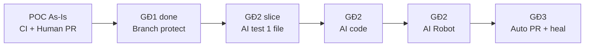

# Evolution Roadmap: POC → AI Orchestrator

Các bước **cụ thể** mở rộng từ repo hiện tại — không gắn tuần; làm xong bước trước rồi mới bước sau.

---

## Trạng thái xuất phát (As-Is)

- [x] Node API steel thread (`src/app.js`)
- [x] Jest unit + coverage threshold
- [x] SonarCloud + SonarLint Cursor
- [x] GitHub Actions: unit → Sonar → Robot `@critical`
- [x] k6 script (`perf/k6/steel_thread.js`)
- [ ] Branch protection + required status checks
- [ ] k6 chạy local/Docker thành công
- [ ] PR học tập merge vào `main`

---

## Bước A — Hoàn thiện Giai đoạn 1 (Guardrails)

| ID | Việc | Deliverable |
|----|------|-------------|
| A1 | Bật branch protection trên `main` | GitHub Settings |
| A2 | Required checks: `build-test-sonar`, `e2e-robot` | GitHub |
| A3 | SonarCloud Quality Gate trên **new code** | Sonar UI |
| A4 | (Tùy chọn) Nightly workflow full Robot | `.github/workflows/nightly-e2e.yml` |
| A5 | Document runbook local | `scripts/test-local.ps1` ✅ |
| A0 | Hướng dẫn branch protection | `docs/dev/branch-protection.md` ✅ |

**Exit:** Mọi PR phải CI xanh + 1 approval mới merge.

---

## Bước B — Vertical slice Giai đoạn 2 (nhỏ nhất)

| ID | Việc | Deliverable |
|----|------|-------------|
| B1 | Template requirements | `docs/requirements/example-feature.md` ✅ |
| B2 | Script đọc requirements → LLM hoặc `--template` | `tools/ai-test-gen/` ✅ |
| B3 | Pydantic validate output | `tools/ai-test-gen/schemas.py` ✅ |
| B4 | CI: validate generated tests (LLM tắt trên CI cho đến khi có secret) | `validate.py` + `ci.yml` ✅ |
| B5 | Human review bắt buộc trước merge generated test | `tools/ai-test-gen/README.md` ✅ |

**Exit:** Ticket mẫu → test file → CI pass — **chưa** sinh production code tự động.

---

## Bước C — AI Code Agent (GĐ2 mở rộng)

| ID | Việc | Deliverable |
|----|------|-------------|
| C1 | Prompt + schema cho patch `src/` (1 endpoint) | `tools/ai-code-gen/` |
| C2 | Orchestrator Python (LangGraph hoặc script) | `orchestrator/` |
| C3 | `workflow_dispatch` GHA gọi orchestrator | `.github/workflows/ai-pipeline.yml` |
| C4 | Feature branch commit từ bot (không push main) | Git policy |

**Exit:** requirements.md → code diff trên branch → CI guardrails.

---

## Bước D — AI Test Agent + Robot (GĐ2 đủ)

| ID | Việc | Deliverable |
|----|------|-------------|
| D1 | Agent 2 đọc code → sinh `.robot` suite | `tests/e2e-robot/generated/` |
| D2 | CI tách generated vs `critical` stable | Tags Robot |
| D3 | QA review generated suites | CONTRIBUTING update |

---

## Bước E — Giai đoạn 3 (đóng vòng)

| ID | Việc | Deliverable |
|----|------|-------------|
| E1 | `gh pr create` khi Sonar + test pass | Orchestrator step |
| E2 | Comment tag `@mentor` / team | GitHub API |
| E3 | Self-heal: parse Sonar + JUnit log → prompt fix (max 3) | Orchestrator loop |
| E4 | Metrics export PR cycle time | Optional workflow |

**Exit:** Ticket → branch → guardrails → PR sẵn review — **không** auto-merge.

---

## Bước F — BankCo mở rộng (sau ổn định)

| ID | Việc |
|----|------|
| F1 | k6 trong workflow scheduled (Perf URL) |
| F2 | Jira webhook → trigger orchestrator |
| F3 | KPI dashboard (Sonar + Git APIs) |

---

## Sơ đồ tiến hóa

---

## Không làm trong POC học tập

- Full autonomous merge without human  
- 20k VUs k6 on every push  
- Thay thế toàn bộ dev bằng AI không review  

---

## Liên quan

- [target-ai-orchestrator.md](target-ai-orchestrator.md)
- [as-is-vs-to-be.md](as-is-vs-to-be.md)
- [how-to-build-workflow.md](how-to-build-workflow.md)
