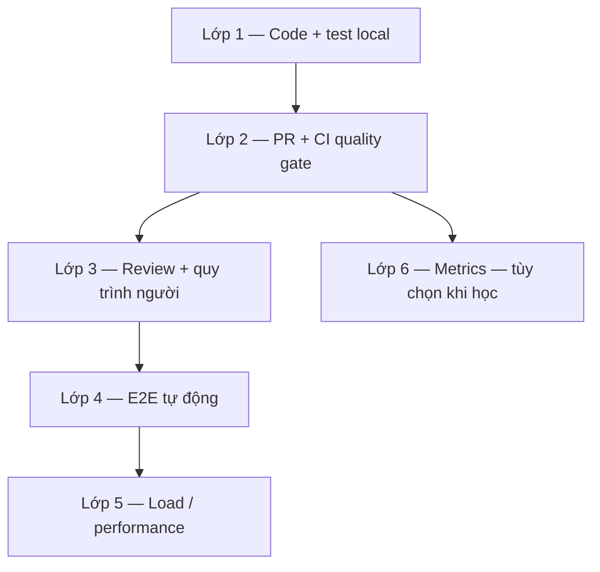
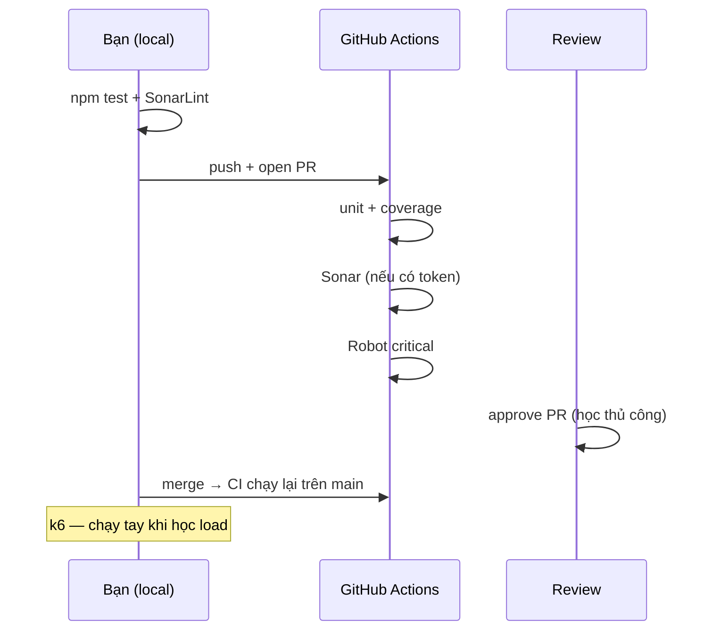

# Cách xây dựng workflow (Development & Test)

Hướng dẫn **thứ tự và cách lắp** từng phần của workflow GenAI SDLC — dùng cho **học tập / POC**, không gắn timeline dự án.

Repo POC Node.js đã có ví dụ từng lớp; tài liệu này giải thích **vì sao** và **làm thế nào** để tự xây lại hoặc mở rộng.

---

## 1. Workflow gồm những lớp gì?



| Lớp | Mục đích | Chạy khi nào |
|-----|----------|--------------|
| **1** | Code đúng chuẩn trước khi đẩy lên remote | Mỗi lần dev (local) |
| **2** | Máy CI kiểm tra build, unit, Sonar | Mỗi PR / push `main` |
| **3** | Người review, không auto-merge | Khi PR mở |
| **4** | Hành trình user/API end-to-end | PR (critical) hoặc sau merge |
| **5** | Chịu tải, steel thread | Tay hoặc pipeline release (học: chạy k6 local) |
| **6** | Đo KPI (coverage, merge time…) | Tùy chọn |

---

## 2. Thứ tự xây dựng (phụ thuộc kỹ thuật)

Làm **theo số**, không nhảy bước — bước sau cần bước trước.

### Bước 1 — Ứng dụng + unit test (nền)

**Mục tiêu học:** Có thứ CI có thể build và test được.

| Việc cần làm | Trong POC |
|--------------|-----------|
| API/service tối thiểu (1 steel thread) | `src/app.js` — login → catalog → cart → checkout |
| Unit test + coverage | `tests/unit/`, `npm test` |
| Ngưỡng coverage trong Jest | `package.json` → `coverageThreshold` |

**Cách làm:**

1. Viết API rõ từng endpoint.
2. Viết test mô tả steel thread (một test case chạy full flow).
3. Chạy `npm test` cho đến khi pass và coverage đủ ngưỡng.

**Không cần:** Sonar, Robot, CI — chỉ cần app + unit test ổn.

---

### Bước 2 — Git + Pull Request

**Mục tiêu học:** Mọi thay đổi đi qua PR, CI có “điểm móc”.

| Việc cần làm | Gợi ý |
|--------------|--------|
| Repo Git, branch `main` | `git init`, push GitHub |
| Feature branch → PR | Không push thẳng `main` khi học workflow |
| (Tùy chọn) Branch protection | GitHub: require PR, require status checks |

**Trigger workflow:** PR opened / push to PR branch → CI sẽ chạy (bước 3).

---

### Bước 3 — CI: build + unit trên PR

**Mục tiêu học:** Máy trung lập chạy lại `npm test` mỗi PR.

| Việc cần làm | Trong POC |
|--------------|-----------|
| Pipeline YAML | `.github/workflows/ci.yml` job `build-test-sonar` |
| `npm ci` + `npm run test:ci` | Giống local, có JUnit/coverage artifact |

**Cách làm:**

1. Tạo workflow `on: pull_request` + `push` branches `main`.
2. Push PR thử → tab Actions xem pass/fail.
3. Hiểu: **local pass ≠ CI pass** (khác OS, env, dependency lock).

**Chạy khi:** Mỗi push lên branch có PR, và mỗi push lên `main` sau merge.

---

### Bước 4 — SonarQube (shift-left + gate)

**Mục tiêu học:** Chất lượng code đo được; PR có thể bị chặn nếu QG fail.

| Thành phần | Vai trò |
|------------|---------|
| **SonarLint** (IDE) | Báo lỗi trước commit — học “shift-left” |
| **SonarQube Server / SonarCloud** | Báo cáo tập trung, Quality Gate |
| **Scanner trong CI** | Upload analysis sau unit test |

| Trong POC | File |
|-----------|------|
| Cấu hình project | `sonar-project.properties` |
| CI step | `ci.yml` — chỉ chạy nếu có `SONAR_TOKEN` |

**Cách làm (học):**

1. Tạo project trên SonarCloud (free cho public repo).
2. Thêm secrets `SONAR_TOKEN`, `SONAR_HOST_URL` trên GitHub.
3. Mở PR cố tình để smell → xem QG fail → sửa → pass.

**Chạy khi:** Cùng pipeline PR, sau bước unit test.

---

### Bước 5 — GenAI + chuẩn code (quy trình, không phải CI)

**Mục tiêu học:** AI hỗ trợ viết code nhưng **không thay** review và Sonar.

| Việc cần làm | Trong POC |
|--------------|-----------|
| Quy tắc cho AI | `.cursor/rules/workflow-sdlc.mdc` |
| Checklist PR | `CONTRIBUTING.md` |

**Cách làm:** Đọc ADR-05 trong [../architecture/adr.md](../architecture/adr.md) — GenAI dừng ở commit; gate phía sau vẫn bắt buộc.

**Chạy khi:** Liên tục lúc code (IDE), không có cron.

---

### Bước 6 — Peer review (người)

**Mục tiêu học:** Workflow “merge-ready” là **con người** approve, không phải bot.

| Việc cần làm | Gợi ý học |
|--------------|-----------|
| 1 reviewer trên PR | Tự review trên repo cá nhân hoặc nhờ bạn |
| Comment / Approve trên GitHub | Hiểu difference request vs approve |
| (Tùy chọn) Label `merge-ready` | Khi CI xanh + đã approve |

**Chạy khi:** Sau CI xanh (hoặc song song); **trước merge**.

**Không tự động** trong POC — GitHub không bật review thì merge được khi CI pass.

---

### Bước 7 — E2E Robot (`@critical`)

**Mục tiêu học:** Test hành trình thật qua HTTP (steel thread), tách khỏi unit test.

| Việc cần làm | Trong POC |
|--------------|-----------|
| Robot + RequestsLibrary | `tests/e2e-robot/` |
| Tag `critical` cho PR | `steel_thread_checkout.robot` |
| CI: start API → robot | Job `e2e-robot` trong `ci.yml` |

**Cách làm (local trước):**

```bash
npm start
pip install -r tests/e2e-robot/requirements.txt
npm run test:e2e
```

Sau đó push PR → xem job `e2e-robot` trên Actions.

**Chạy khi (POC):** Mỗi PR và push `main`, sau job unit test thành công.

**Mở rộng (học thêm):** Nightly full suite — thêm `on: schedule` trong workflow; PR chỉ `--include critical` (ADR-03).

---

### Bước 8 — Load test (k6) — tách khỏi PR

**Mục tiêu học:** Steel thread chịu tải; không nhồi 20k VUs vào mỗi PR.

| Trong POC | `perf/k6/steel_thread.js` |
|-----------|---------------------------|
| Chạy | **Thủ công:** `npm start` + `k6 run perf/k6/steel_thread.js` |

**Cách làm:** Đọc thresholds trong script; tăng `stages` dần khi hiểu metric `http_req_duration`, `http_req_failed`.

**Chạy khi (production-like):** Scheduled hoặc pre-release — **không** bắt buộc cho học PR workflow.

---

### Bước 9 — Metrics (tùy chọn)

**Mục tiêu học:** Hiểu KPI slide, không bắt buộc dashboard lúc đầu.

Đọc [../metrics/kpi-definitions.md](../metrics/kpi-definitions.md) — có thể đếm tay: số PR, thời gian merge, % coverage từ Sonar.

---

## 3. Sơ đồ: xây xong từng lớp thì chạy khi nào?



---

## 4. Map POC → từng lớp

| Lớp | Đã có trong repo? | Lệnh / file |
|-----|-------------------|-------------|
| 1 App + unit | Có | `npm test`, `src/`, `tests/unit/` |
| 2 Git PR | Bạn tự push GitHub | — |
| 3 CI unit | Có | `.github/workflows/ci.yml` |
| 4 Sonar | Có (cần token) | `sonar-project.properties` |
| 5 GenAI rules | Có | `.cursor/rules/`, `CONTRIBUTING.md` |
| 6 Review | Quy trình | GitHub PR UI |
| 7 Robot E2E | Có | `npm run test:e2e`, CI job |
| 8 k6 load | Có script | `k6 run perf/k6/steel_thread.js` |
| 9 Metrics | Chỉ docs | `docs/metrics/` |

---

## 5. Checklist học tập (không theo tuần)

Đánh dấu khi **hiểu và chạy được** từng mục:

- [ ] Giải thích được steel thread API (4 bước + health)
- [ ] `npm test` pass, đọc được báo cáo coverage
- [ ] Tạo PR và thấy CI chạy 2 job (unit + robot)
- [ ] (Tùy chọn) SonarCloud project + QG trên PR
- [ ] Viết thêm 1 unit test và 1 dòng Robot cho feature giả
- [ ] Approve PR bằng tay và merge
- [ ] Chạy k6 local, đọc được p95 / error rate
- [ ] Đọc macro workflow: [../workflow/macro-workflow.md](../workflow/macro-workflow.md)

---

## 6. Tài liệu liên quan

| Chủ đề | File |
|--------|------|
| Luồng tổng thể | [../workflow/macro-workflow.md](../workflow/macro-workflow.md) |
| Chi tiết 3 cột slide | [../workflow/sub-workflows.md](../workflow/sub-workflows.md) |
| Sequence từng nhánh | [../sequences/](../sequences/) |
| Kiến trúc | [../architecture/logical-architecture.md](../architecture/logical-architecture.md) |
| Quyết định thiết kế | [../architecture/adr.md](../architecture/adr.md) |

---

## 7. Phần đã bỏ (học tập)

Không dùng trong lộ trình học repo này:

- Gantt 16 tuần, phase theo calendar
- RACI tổ chức, target KPI 12 tháng
- ADO triển khai doanh nghiệp (vẫn có template `.ado/` để tham khảo)

Khi cần triển khai thật ở công ty, tham khảo thêm slide BankCo và mở rộng nightly/load/deploy Test env.
