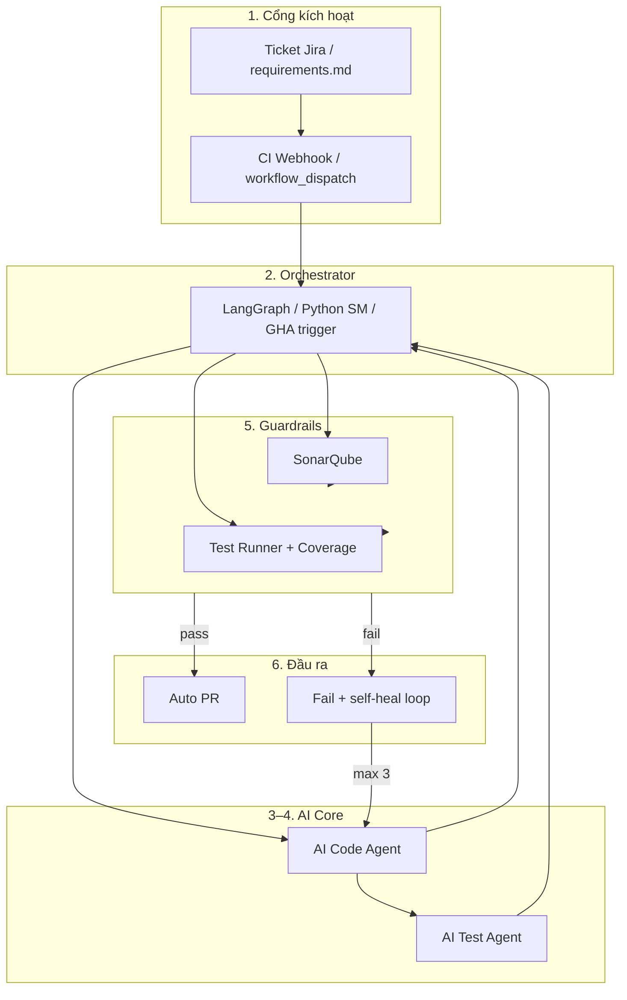
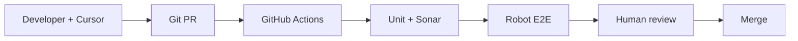

# Target: AI Orchestrator SDLC (To-Be)

Blueprint **mục tiêu** — hệ thống Orchestrator + dual AI Agent (Code + Test) + Guardrails + auto PR — so với **POC hiện tại** (human-in-the-loop + CI).

| Tài liệu | Nội dung |
|----------|----------|
| [As-Is vs To-Be](as-is-vs-to-be.md) | Bảng so sánh từng thành phần |
| [Sequence: POC (As-Is)](../sequences/as-is-poc-workflow.md) | Luồng đang chạy trên GitHub |
| [Sequence: AI Orchestrator (To-Be)](../sequences/ai-orchestrator-to-be.md) | Luồng mục tiêu |
| [Evolution roadmap](evolution-roadmap.md) | Bước mở rộng từ POC → To-Be |

---

## 1. Ba giai đoạn triển khai (To-Be)

### Giai đoạn 1 — Chuẩn hóa hạ tầng & chốt chặn

| Hạng mục | Mô tả |
|----------|--------|
| SonarQube / SonarCloud | Quét tĩnh, Quality Gate trên PR |
| Test tự động | Robot Framework (E2E) + unit (Jest) |
| CI/CD | GitHub Actions (hoặc GitLab CI) |

**POC hiện tại:** xem [as-is-vs-to-be.md](as-is-vs-to-be.md) — **~80% GĐ1**.

### Giai đoạn 2 — AI Core & định dạng

| Hạng mục | Mô tả |
|----------|--------|
| AI Code Agent | Claude / GPT API — sinh code từ Requirements |
| AI Test Agent | Sinh Robot / PyTest từ code đã sinh |
| Orchestrator | LangGraph hoặc state machine Python |
| Contract | JSON schema (Pydantic) — output máy đọc được |

**POC hiện tại:** Cursor/Copilot **assist** — **chưa** GĐ2.

### Giai đoạn 3 — Đóng vòng & đo lường

| Hạng mục | Mô tả |
|----------|--------|
| Auto PR | Push branch + tạo PR khi guardrails pass |
| Coverage gate | >50% (BankCo), chặn merge |
| Self-healing | Tối đa 3 vòng sửa từ log Sonar/test |
| Human-in-the-loop | Mentor review, merge <1 ngày |

**POC hiện tại:** CI gate + review thủ công — **một phần GĐ3**.

---

## 2. Kiến trúc To-Be (tóm tắt)

**POC As-Is** (không Orchestrator / dual agent):

---

## 3. Workflow To-Be (không đổi logic nghiệp vụ)

1. **Nhận đầu vào** — `requirements.md` hoặc Jira ticket  
2. **AI sinh code** — Agent 1  
3. **AI sinh test** — Agent 2 (happy path + edge cases)  
4. **Sonar** — fail → dừng / self-heal  
5. **Test execution** — coverage ≥50%  
6. **Đánh giá** — pass → auto PR + tag mentor; fail → log → AI sửa (≤3) hoặc dev  

Chi tiết sequence: [ai-orchestrator-to-be.md](../sequences/ai-orchestrator-to-be.md).

---

## 4. Nguyên tắc khi nối từ POC

| # | Nguyên tắc |
|---|------------|
| 1 | **Giữ Guardrails** đang chạy (`ci.yml`, SonarCloud, Robot) — đừng thay bằng AI trước khi ổn |
| 2 | **Human-in-the-loop** trên merge (ADR-05, slide BankCo ~80% merge-ready) |
| 3 | **Orchestrator** nên là service/job riêng; GitHub Actions chỉ **trigger** |
| 4 | **Test do AI sinh** phải qua review + mutation test dần |
| 5 | **Một vertical slice** trước (1 endpoint → 1 unit file) rồi mới full ticket |

---

## 5. Template đầu vào (GĐ2+)

Ví dụ ticket/requirements: [../requirements/example-feature.md](../requirements/example-feature.md)

---

## 6. Liên quan BankCo slide

| Cột Development & Test | POC As-Is | To-Be |
|------------------------|-----------|-------|
| Code Development | Cursor assist | AI Code Agent |
| Code Review | Human PR | Auto PR + human merge |
| Code Quality | SonarCloud + SonarLint | Guardrails Sonar |
| Automated Testing | Robot (manual suites) | AI Test → Robot |
| Load Testing | k6 script local | Sau E2E ổn |

---

## 7. Tài liệu POC đang dùng

- [how-to-build-workflow.md](how-to-build-workflow.md) — lớp kỹ thuật đã build  
- [logical-architecture.md](../architecture/logical-architecture.md) — containers hiện tại  
- [macro-workflow.md](../workflow/macro-workflow.md) — macro flow PR-centric
