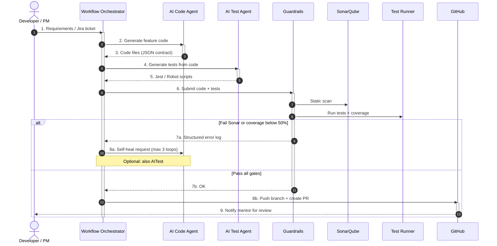

# Sequence: AI Orchestrator (To-Be)

Luồng **mục tiêu** — ticket/requirements → dual AI → guardrails → auto PR hoặc self-heal. **Chưa triển khai** trong repo.

## Diagram

## Guardrails detail (To-Be)

| Check | Tool (POC tương đương) |
|-------|-------------------------|
| Static | SonarCloud (`sonar-project.properties`) |
| Unit + coverage | Jest (`npm run test:ci`) |
| E2E critical | Robot (`tests/e2e-robot/`) |
| Load (optional) | k6 — not in PR gate |

## Human-in-the-loop (bắt buộc)

- Auto PR **không** auto-merge (align ADR-05, BankCo ~80% merge-ready after review).
- Mentor approves on GitHub UI.

## Implementation status

| Step | Status in repo |
|------|----------------|
| 1–5 AI pipeline | Not implemented |
| 6 Guardrails | Implemented (CI) |
| 8b Auto PR | Not implemented |
| 8a Self-heal | Not implemented |

Roadmap: [../plan/evolution-roadmap.md](../plan/evolution-roadmap.md).

## Related

- [as-is-poc-workflow.md](as-is-poc-workflow.md)
- [../plan/target-ai-orchestrator.md](../plan/target-ai-orchestrator.md)
