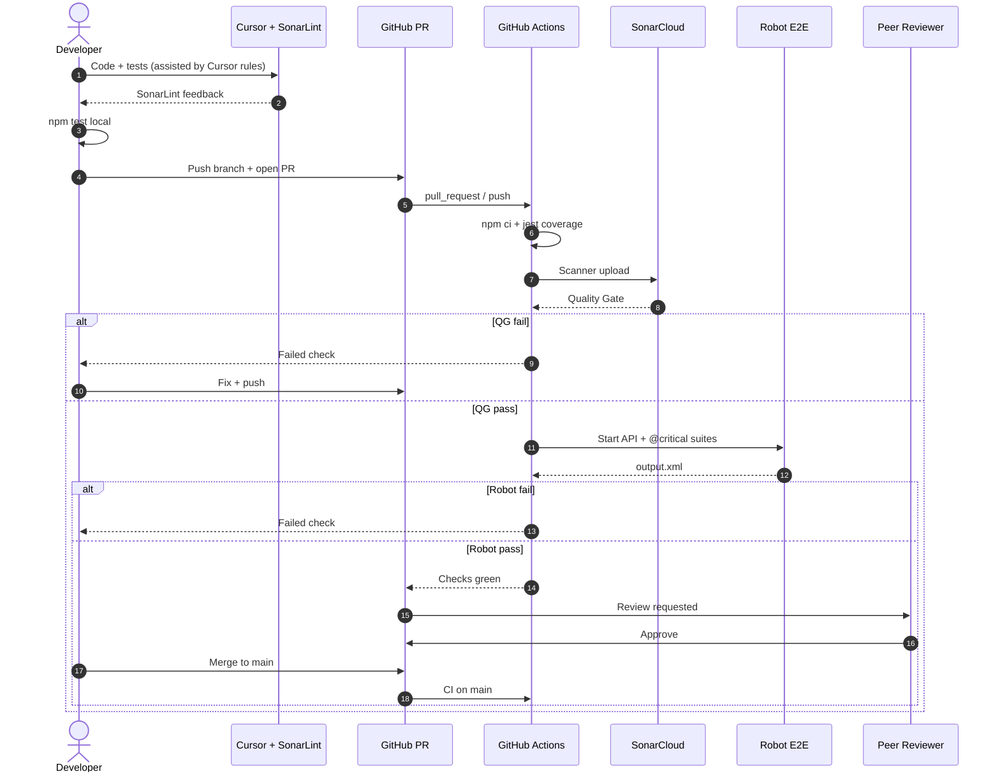

# Sequence: POC As-Is (workflow-ai hiện tại)

Luồng **đang triển khai** trên GitHub — human-in-the-loop + CI guardrails. Không có AI Orchestrator tự động.

## Diagram

## Mapping repo

| Bước | Artifact |
|------|----------|
| Local test | `npm test`, `npm run test:e2e` |
| CI unit + Sonar | `.github/workflows/ci.yml` job `build-test-sonar` |
| Robot | job `e2e-robot` |
| Sonar config | `sonar-project.properties` |
| IDE | `.vscode/settings.json`, `docs/dev/sonarlint-cursor.md` |

## Khác To-Be

- Không có Orchestrator, AI Code/Test Agent, auto PR, self-heal.
- Xem [ai-orchestrator-to-be.md](ai-orchestrator-to-be.md).

## Related

- [pr-merge-happy-path.md](pr-merge-happy-path.md)
- [../plan/as-is-vs-to-be.md](../plan/as-is-vs-to-be.md)
