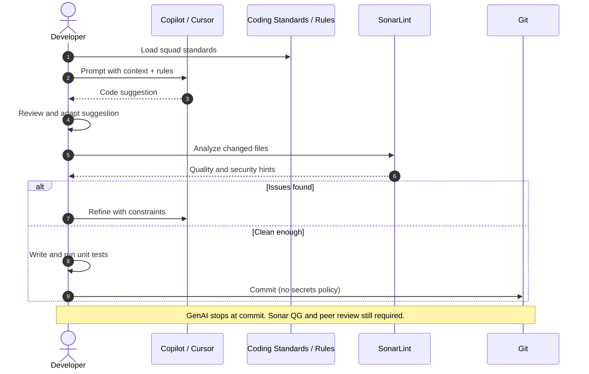
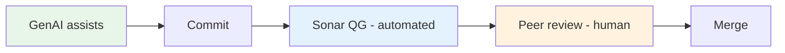

# Sequence: GenAI-Assisted Development Loop

GitHub Copilot or Cursor assists coding; quality gates remain human and automated.

## Diagram

## Guardrails (DevEx)

| Rule | Rationale |
|------|-----------|
| No secrets in prompts or commits | Security policy |
| Human reviews all AI-generated logic | ~80% merge-ready KPI |
| Unit tests required for new behavior | Coverage and regression |
| Follow squad naming and structure | Sonar and review consistency |
| Do not disable Sonar rules to pass gate | Quality over speed |

## Recommended rule sources

- `CONTRIBUTING.md` — human-readable standards
- `.cursor/rules/` or Copilot instructions — machine-readable for GenAI
- Sonar quality profile — enforced on PR

## Boundary

## Related

- [../architecture/adr.md](../architecture/adr.md) (ADR-05)
- [pr-merge-happy-path.md](pr-merge-happy-path.md)
