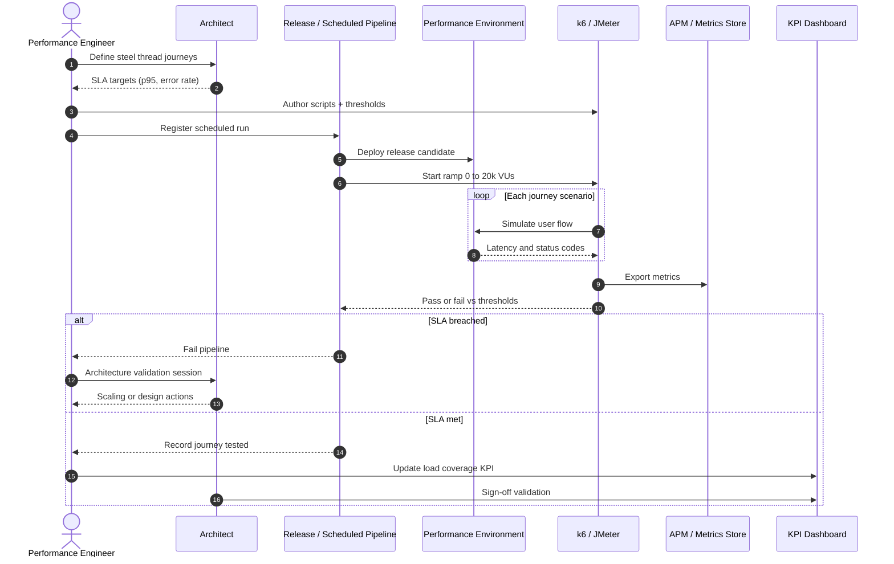

# Sequence: Load Testing — Steel Thread

Steel Thread Phase 2 with ramp to 20k+ simulated users and architecture validation.

## Diagram



## Example thresholds (k6)

```javascript
// Illustrative — tune per journey
export const options = {
  stages: [
    { duration: '10m', target: 5000 },
    { duration: '20m', target: 20000 },
    { duration: '10m', target: 0 },
  ],
  thresholds: {
    http_req_duration: ['p(95)<800'],
    http_req_failed: ['rate<0.001'],
  },
};
```

## Steel thread registry (recommended fields)

| Field | Description |
|-------|-------------|
| `journey_id` | Unique ID matching test plan |
| `phase` | 1 (baseline) or 2 (20k+) |
| `last_run` | ISO date |
| `max_vus` | Peak virtual users |
| `p95_ms` | 95th percentile latency |
| `error_rate` | Failed requests / total |
| `arch_signoff` | Y/N + reviewer |

## KPI linkage

- **~70% happy-path load-tested at 20k+:** journeys with successful Phase 2 run / total happy-path journeys

## Related

- [../workflow/sub-workflows.md](../workflow/sub-workflows.md#3-load-testing-steel-thread)
- [../architecture/deployment-topology.md](../architecture/deployment-topology.md)
