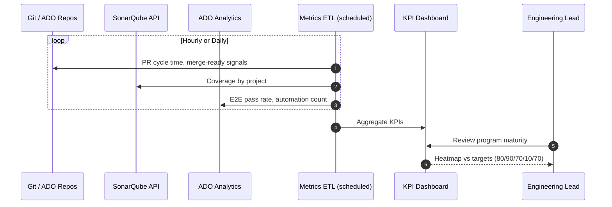

# Sequence: Metrics Collection

ETL from Git, SonarQube, and ADO into the program KPI dashboard.

## Diagram

## Data sources

| KPI | Primary source | Suggested query / signal |
|-----|----------------|---------------------------|
| Merge-ready after review | ADO / Git PR API | PRs approved without `changes requested` after first review |
| Coverage >50% | SonarQube API | `coverage` measure per project |
| Merge <1 business day | Git / ADO | `mergedAt - createdAt` in business hours |
| Critical automated % | ADO Test Plans | `automated_critical / total_critical` |
| Load journey coverage | Load registry DB | `journeys_passed_20k / total_happy_path` |

## Dashboard views

1. **Program heatmap** — maturity by SDLC stage (matches slide legend)
2. **Squad drill-down** — PR cycle time, review rounds, Sonar failures
3. **Test automation trend** — Robot case count over sprints
4. **Load coverage** — steel threads and last 20k run status

## Ritual

- **Weekly:** squad lead reviews squad tile
- **Bi-weekly:** program review with engineering leadership
- **Monthly:** adjust quality gate thresholds and automation backlog

## Related

- [../metrics/kpi-definitions.md](../metrics/kpi-definitions.md)
- [../plan/implementation-plan.md](../plan/implementation-plan.md)
