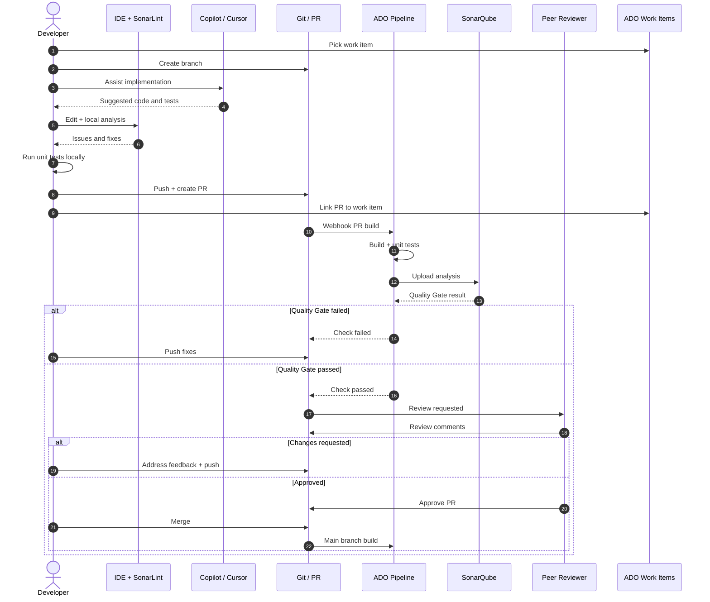

# Sequence: PR Merge Happy Path

Code development, SonarQube quality gate, and peer review through merge.

## Diagram

## Preconditions

- Branch policy requires PR to `main`
- SonarQube project bound to repository
- CI service connection and Sonar token configured

## Postconditions

- `main` build succeeds
- SonarQube analysis on `main` updated
- Work item can move to Done per team rules

## Failure handling

| Failure | Action |
|---------|--------|
| Unit test fail | Developer fixes locally; re-push |
| Quality gate fail | Fix code or tests; check coverage on new code |
| Review rejected | Address comments; no merge until re-approval |

## KPI linkage

- **Merge-ready after review:** first approval without major rework
- **Merge <1 business day:** timestamp PR created → merged (business hours)

## Related

- [../workflow/sub-workflows.md](../workflow/sub-workflows.md#1-code-development-code-review-code-quality)
- [robot-e2e.md](robot-e2e.md)
