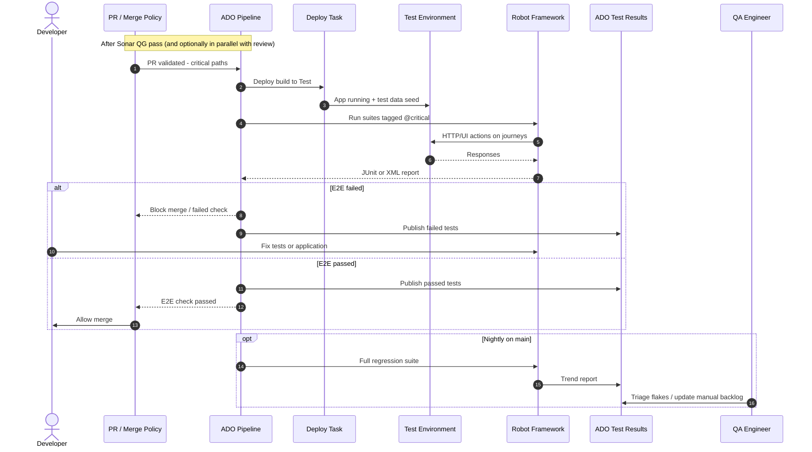

# Sequence: Robot Framework E2E

Deploy to test environment and run Robot suites on PR (`@critical`) and nightly (full).

## Diagram

## Pipeline configuration notes

| Setting | PR build | Nightly |
|---------|----------|---------|
| Tags | `critical` | all suites |
| Timeout | 15–30 min | 60–120 min |
| Retry | 1 retry on flake (optional) | no auto-retry |
| Artifacts | log.html, output.xml | same + archive 30d |

## ADO integration

1. Publish test results task consumes Robot `output.xml`
2. Link test run to build number and commit SHA
3. Failed tests create bugs automatically (optional team setting)

## KPI linkage

- **% critical automated:** count automated / total critical in test plan

## Related

- [../workflow/sub-workflows.md](../workflow/sub-workflows.md#2-automated-testing-robot-framework)
- [../architecture/adr.md](../architecture/adr.md) (ADR-02, ADR-03)
