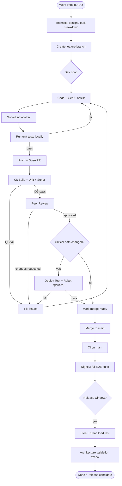
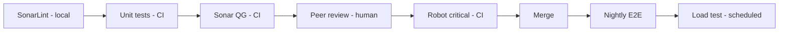
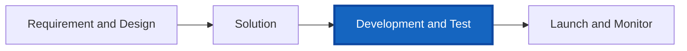

# Macro Workflow — Development & Test

End-to-end flow from work item to release candidate, aligned with the BankCo GenAI SDLC slide.

## Full flowchart

## Stage summary

| Stage | Owner | Entry | Exit criteria |
|-------|-------|-------|---------------|
| Work item | PO / team | ADO backlog | Task ready with acceptance criteria |
| Dev loop | Developer | Branch created | Local unit pass; SonarLint acceptable |
| PR automation | CI | PR opened | Sonar quality gate pass |
| Peer review | Reviewer | QG green | Approval; ~80% target merge-ready first round |
| E2E (conditional) | CI + QA | Critical paths touched | `@critical` Robot pass |
| Merge | Developer | All gates green | On `main` |
| Nightly | CI | Merge to main | Full Robot suite reported |
| Load (scheduled) | Perf + Architect | Release window | Steel Thread SLA met; KPI updated |

## Gate model

| Gate | Type | Blocks PR merge |
|------|------|-----------------|
| G1 SonarLint | Advisory / team policy | No |
| G2 Unit tests | Automated | Yes |
| G3 Sonar QG | Automated | Yes |
| G4 Peer review | Human | Yes |
| G5 Robot `@critical` | Automated | Configurable |
| G6 Merge | — | — |
| G7 Nightly E2E | Automated | No (alerts) |
| G8 Load test | Automated | Release only (optional) |

## SDLC context (four stages from slide)

**Current program focus:** Stage 3 (Development & Test).

## Related documents

- [sub-workflows.md](sub-workflows.md)
- [../sequences/pr-merge-happy-path.md](../sequences/pr-merge-happy-path.md)
- [../plan/implementation-plan.md](../plan/implementation-plan.md)
