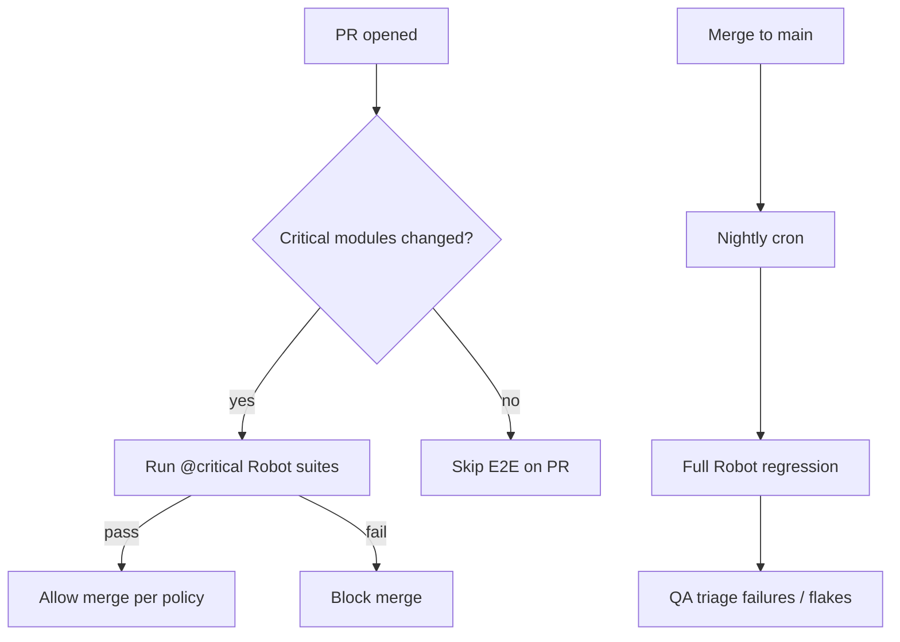

# Sub-Workflows

Detailed flows for the three columns under **Development & Test** on the source slide.

---

## 1. Code Development, Code Review, Code Quality

### Activities (from slide)

- Code peer review (manual)
- Squad sessions for code standards
- Code review process metrics implementation
- Automated tools (SonarQube) PR integration
- GitHub Copilot enabled with DevEx improvements
- SonarQube IDE tooling

### Process steps

| Step | Actor | Output | Gate |
|------|-------|--------|------|
| 1 | Developer | Code + unit tests | SonarLint within team threshold |
| 2 | Developer | PR opened | Linked ADO work item |
| 3 | CI | Sonar report on PR | Quality gate pass |
| 4 | Peer reviewer | Comments / approval | ≥1 approval; no blocking threads |
| 5 | System / lead | Label `merge-ready` | QG + approval + optional E2E |

### Target outcomes (slide)

| Metric | Target |
|--------|--------|
| Merge-ready after peer review | ~80% |
| Codebases >50% test coverage | ~90% of repos |
| Merged in <1 business day | ~70% of changes |

### Squad session cadence (recommended)

- **Bi-weekly:** coding standards, Sonar rule changes, GenAI guardrails
- **Monthly:** review metrics retro (merge-ready %, cycle time)
- **Output:** updated standards doc + Cursor/Copilot rules

---

## 2. Automated Testing (Robot Framework)

### Activities (from slide)

- Robot Framework for end-to-end testing
- Manual testing process standardization
- ADO component standardization

### PR vs nightly



### Robot repository structure (recommended)

```
tests/e2e-robot/
├── resources/           # Shared keywords
├── suites/
│   └── critical/        # @critical tags for PR
│       ├── login.robot
│       └── payment_happy_path.robot
└── variables/
    └── env/
        ├── test.yaml
        └── qa.yaml
```

### Automation backlog process

1. Maintain manual test cases in **ADO Test Plans** with priority (critical / high / medium).
2. Each sprint: convert **N** critical manual cases to Robot (target path 10% → 50%).
3. Tag automated cases with same ID as manual for traceability.
4. Report **% critical automated** on program dashboard.

### Target outcome (slide)

| Metric | Baseline | Growth target |
|--------|----------|-----------------|
| Critical functional cases automated | ~10% | ≥50% in 12 months |

---

## 3. Load Testing (Steel Thread)

### Activities (from slide)

- Steel Thread Phase 1/2 for foundational user journeys
- Architecture validation

### Phases

| Phase | Goal | Virtual users |
|-------|------|---------------|
| **Phase 1** | Baseline latency and error rate for 1–3 steel threads | Ramp 1k → 5k |
| **Phase 2** | Happy-path coverage at production-like scale | Sustain 20k+ |
| **Validation** | Architect sign-off | p95 SLA, error rate thresholds |

### Steel thread definition

A **steel thread** is the thinnest end-to-end path through the full stack—for example:

`Authenticate → Browse catalog → Add to cart → Checkout → Confirm order`

Each thread gets:

- k6 or JMeter script in `perf/k6/`
- Entry in load test registry (journey name, last run, max VUs, pass/fail)
- Architecture review notes (bottlenecks, scaling actions)

### Target outcome (slide)

| Metric | Baseline |
|--------|----------|
| Happy-path journeys tested at 20k+ simulated users | ~70% |

---

## Cross-cutting: GenAI integrated workflow

GenAI accelerates **Code Development** only. It does not replace:

- SonarQube quality gate
- Peer review
- Robot E2E
- Load testing

See [../sequences/genai-dev-loop.md](../sequences/genai-dev-loop.md).

## Related documents

- [macro-workflow.md](macro-workflow.md)
- [../sequences/robot-e2e.md](../sequences/robot-e2e.md)
- [../sequences/load-testing.md](../sequences/load-testing.md)
